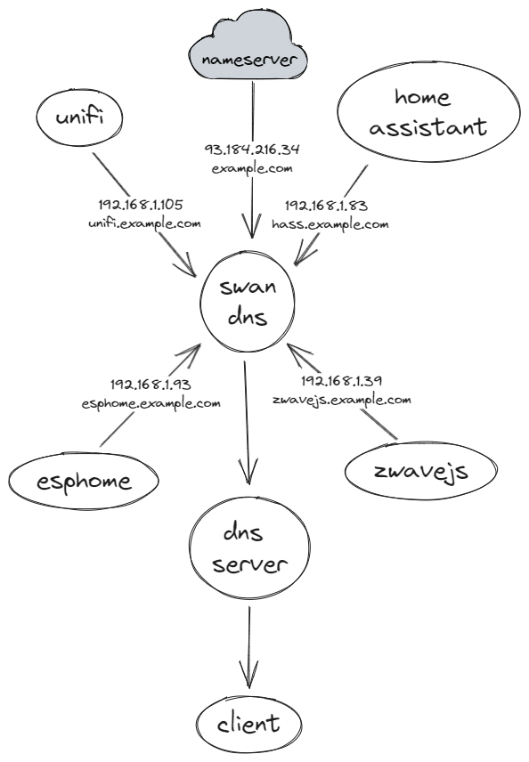

# Swan DNS

An authoritative DNS server for your homelab! I was tired of configuring DNS entries for a bunch of Proxmox VMs/LXCs.
I wanted something that would just work for me.
After not finding a compelling solution, I made Swan DNS.

Swan DNS acts as a registry for your services.
Each of your machines can be configured to publish records pointing to themselves to one or more Swan DNS servers.

Topology example:<br/>

<picture>
  <source media="(prefers-color-scheme: dark)" srcset="./readme-diagram-dark.png">
  
</picture>

## Quickstart

### NixOS

1. Add source using `niv`:
   ```console
   $ niv add jacob-swanson/swandns
   ```
   Flakes might work too, but I'm not currently using them in my homelab.
2. Example server configuration:
   ```nix
   { pkgs, sources, ... }: {
     imports = [
       "${sources.swandns}/nix/swandns.nix"
     ];
     service.swandns = {
       enable = true;
       settings = {
         bind = "eth0";
         dns_port = 53;
         api_port = 8080;
         nameservers = [ "1.1.1.1" "1.0.0.1" ];
         zones = [{
           name = "example.com";
           records = [
             {
               key = "foo";
               value = "192.168.1.5";
             }
           ];
         }];
       };
     };
   }
   ```
   After running `nixos-rebuild switch` the server should start running.
   See [Configuration Reference](#configuration-reference) for details on the settings.
3. Example client configuration:
   ```nix
   { pkgs, sources, ... }: {
     imports = [
       "${sources.swandns}/nix/swandns.nix"
     ];
     service.swandns-update = {
       enable = true;
       default_server_url = "http://127.0.0.1:8080";
       settings = {
         records = [{
           name = "bar.example.com";
         }];
       };
     };
   }
   ```
   After running `nixos-rebuild switch` the update client should run every 5 minutes via a Systemd timer.
   See [Configuration Reference](#configuration-reference) for details on the settings.
4. Check resolution of each record:
   ```console
   $ dig @127.0.0.1 foo.example +short
   192.168.1.5
   $ dig @127.0.0.1 bar.example +short
   192.168.1.6
   $ dig @127.0.0.1 example.com +short
   93.184.216.34
   ```
5. [Setup split DNS on your network](#setting-up-split-dns).

### Container (Docker/Podman)

**Supported architectures:**
- x86-64

**Version tags:**
- `latest` - latest release
- `x.y.z` - specific version

#### docker-compose

1. Create `docker-compose.yaml`.
   ```yaml
   ---
   version: "2.1"
   services:
     swandns:
       image: swandns:latest
       container_name: swandns
       volumes:
         - /path/to/data:/data
       ports:
         - "8080:8080/tcp" # Default API port
         - "53:53/tcp"     # Default DNS port
         - "53:53/udp"
       restart: unless-stopped
   
     swandns-update:
       image: swandns-update:latest
       container_name: swandns-update
       volumes:
         - /path/to/data:/data
       restart: unless-stopped
   ```
2. Create server config file (see [Configuration Reference](#configuration-reference) for more details).<br/>
   `/path/to/data/server.yaml`
   ```yaml
   ---
   data_dir: /data
   dns_port: 53
   api_port: 8080
   nameservers: 
     - 1.1.1.1
     - 1.0.0.1
   zones: 
     - name: example.com
       records:
         - key: foo
           value: 192.168.1.5
   ```
3. Create client config file (see [Configuration Reference](#configuration-reference) for more details).<br/>
   `/path/to/data/client.yaml`
   ```yaml
   ---
   default_server_url: http://127.0.0.1:8080
   records:
     - name: foo.example.com
   ```
4. Check resolution of each record:
   ```console
   $ dig @127.0.0.1 foo.example +short
   192.168.1.5
   $ dig @127.0.0.1 bar.example +short
   192.168.1.6
   $ dig @127.0.0.1 example.com +short
   93.184.216.34
   ```
5. [Setup split DNS on your network](#setting-up-split-dns).

## Configuration Reference

`server.yaml`
```yaml
---
# (Optional) Directory for data storage. Defaults to a platform-specific directory.
data_dir: ~/.local/share/swandns
# (Optional) Name of the Sqlite DB file in `data_dir`, defaults to `swandns.db`.
db_file: swandns.db
# (Optional) Interface to listen on. Defaults to all interfaces.
bind: eth0
# (Optional) Port to listen for DNS requests on. Defaults to `1053`.
#            This should be changed to `53` for non-test deployments.
dns_port: 1053
# (Optional) Port for API. Defaults to `8080`.
api_port: 8080
# (Optional) Upstream nameservers to forward queries to. Defaults to none.
nameservers: 
  - 1.1.1.1
  - 1.0.0.1
# Zones to serve queries for.
zones: 
    # (Required) Name of the zone.
  - name: example.com
    # (Optional) Additional static records to serve for the zone.
    records:
        # (Required) Key of the record to be prepended to the zone name. Use `@` for the root.
      - key: foo
        # (Required) Value for the record. Must be either an IPv4 or IPv6 address.
        value: 127.0.0.1
```

`client.yaml`
```yaml
---
# (Optional) Default URL for the Swan DNS API.
default_server_url: http://127.0.0.1:8080
# (Optional) Default interface to grab the IP. Defaults to the system's default interface.
default_bind: eth0
# (Optional) Protocol for grabbing the IP if not specified by the record. Defaults to `ipv4`.
default_protocol: ipv4
# (Required) Records to send to the server.
records:
     # (Required) The URL for the Swan DNS API. Defaults to `default_server_url`.
   - server_url: http://127.0.0.1:8080
     # (Required) The name of the record.
     name: foo.example.com
     # (Optional) Interface to grab the IP from. Defaults to `default_bind`.
     bind: eth0
     # (Optional) Protocol for the IP from the interface. Defaults to `default_protocol`.
     protocol: ipv4
```

## Setting up Split DNS

- [UniFi Security Gateway](https://davejlong.com/dns-conditional-forwarding-on-unifi-security-gateway/)
- [OPNSense](https://virtualize.link/split-dns/#opnsense)
- [PFSense](https://virtualize.link/split-dns/#pfsense)
- [Pi-hole / Dnsmasq](https://virtualize.link/split-dns/#pihole-dnsmasq)
- [Adguard](https://virtualize.link/split-dns/#adguard)